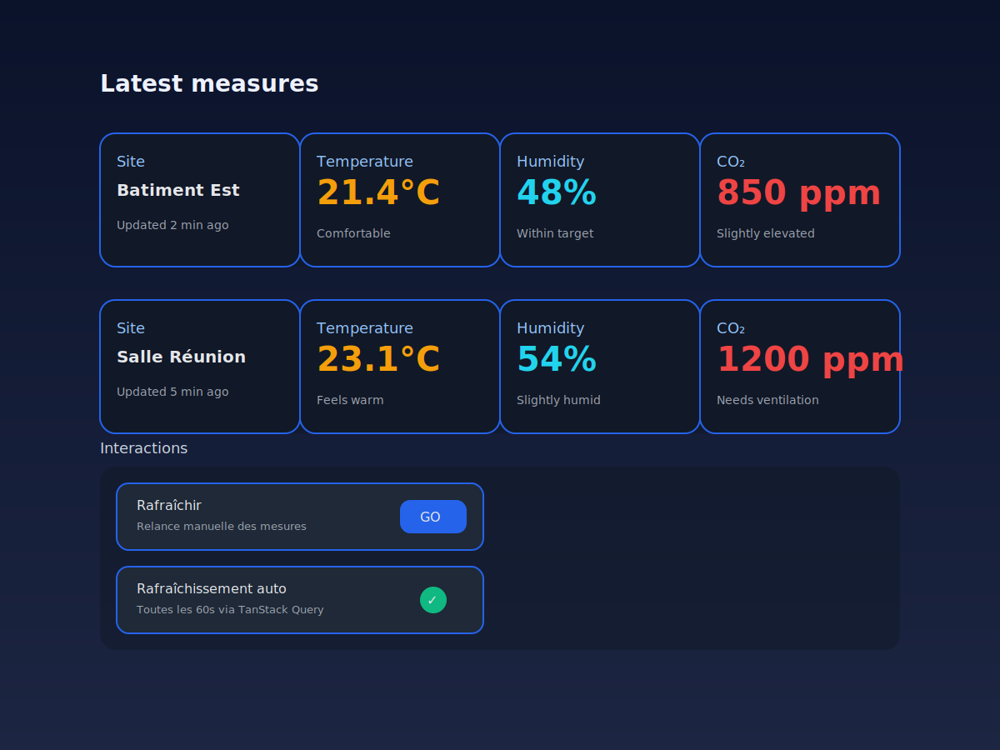

# Aperçu de l'interface frontend

L'aperçu ci-dessous illustre l'interface React/Tailwind fournie par `frontend/src/App.tsx`. Les mesures sont affichées sous forme de cartes verticales : nom du site, température, humidité et CO₂, avec des actions pour rafraîchir manuellement ou suivre le polling automatique.

> Remarque : l'image est une capture statique de l'agencement prévu (fond sombre, cartes verticales, actions de rafraîchissement). Les valeurs illustrent l'état attendu après récupération des dernières mesures via TanStack Query.
